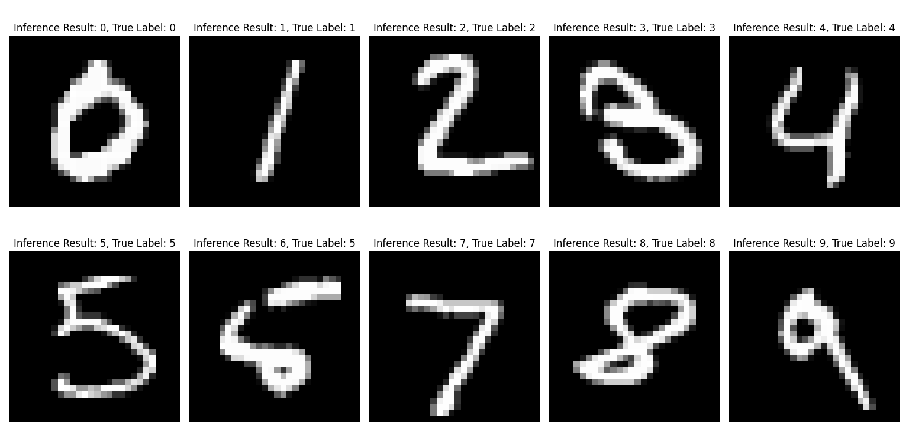

# Installation instructions

This should give an explanation on how to install the library in editable mode inside a Python venv, virtualenv or conda environment. 
Dependencies besides PyTorch should be installed when running the `pyproject.toml`. Document all the steps with the commands using screenshots. 
You only need to explain how to run this on your system (pool computer, private laptop etc.) with your specific OS (e.g. Windows, Ubuntu, MacOS).

## 1. Create venv, virtualenv or conda env
command used: python -m venv myenv

## 2. Activate venv or virtualenv
command used: myenv\Scripts\activate

## 3. Install project in editable mode
command used: pip install -e .

## 4. Install missing hardware-specific dependencies (PyTorch)
command used: pip install torch torchvision torchaudio

## 5. Git commiting with the command line interface
command used: 
git add .
git commit -m "Initial Commit"
git push

# Preperation - Downloading MNIST Dataset

When you are in the environment navigate to the project root folder. Inside the project root folder run:

`python src/mynet/utils.py data`

This utility function downloads the MNIST data and extracts the images into `data/MNIST/`.

# Running test locally

If you configured your environment correctly, you are able to check the test cases without pushing them to github on your local machine. In the project root folder run the following command:

`pytest -v`

If you are using an IDE and run a test case separately, make sure you set the working directory to the project root. Otherwise, the test will not work since it searches files in different directories.

# Visualization Results

